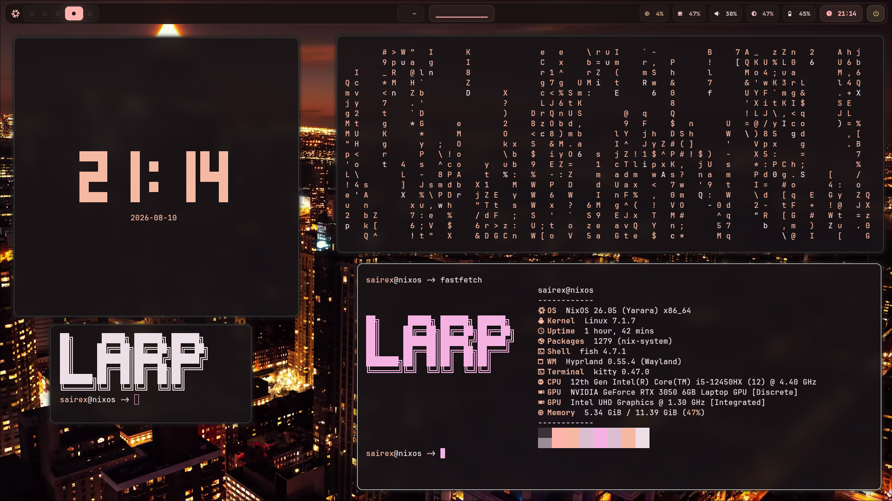
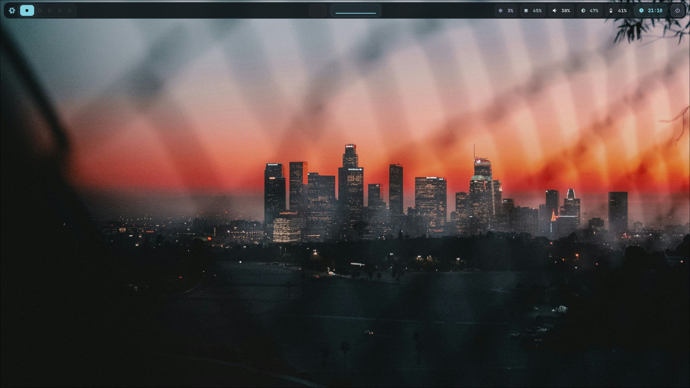
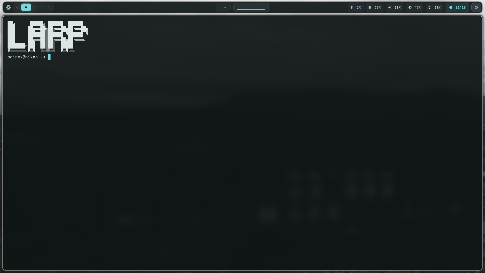

# NixOS / Hyprland Dots

My personal NixOS desktop configuration built around Hyprland.

I keep this repository mainly for my own setup, but feel free to take anything you find useful.

<p align="center">
  
</p>

---

## Setup

| Component | Choice |
| --- | --- |
| OS | NixOS |
| WM | Hyprland |
| Shell | Fish |
| Terminal | Kitty |
| Bar | Waybar |
| Launcher | Rofi |
| Notifications | Dunst |
| Lock screen | Hyprlock |
| Logout menu | Wlogout |
| File manager | Yazi |
| Theming | Matugen |
| Icons | Papirus-Dark |
| Font | JetBrainsMono Nerd Font |

---

## Features

- Dynamic colors generated from the current wallpaper
- Waybar themed with Matugen
- Kitty colors synced with the current theme
- Rofi follows the same color palette
- Dunst notifications use the wallpaper colors
- Hyprlock and Wlogout share the same visual style
- Wallpaper picker with automatic theme updates
- Random color selection from wallpapers

---

## Screenshots

### Desktop

<p align="center">
  
</p>

### Terminal

<p align="center">
  
</p>

---

## Structure

```text
.config/
├── dunst/
├── fish/
├── hypr/
│   └── scripts/
├── hyprlock/
├── kitty/
├── matugen/
│   └── templates/
├── rofi/
├── waybar/
├── wlogout/
└── yazi/